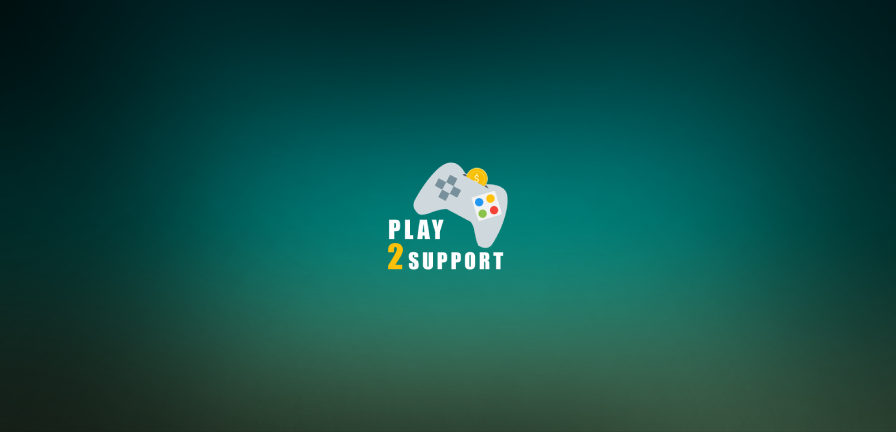

# Play2Support 🎮 🚀

Play2Support is a small Unity game project developed for the purpose of supporting refugee and revolutionaries who suffering the impact of civil war in myanmar 🇲🇲 .

  

## Gallery

    
    
    

